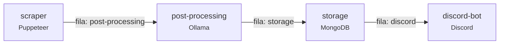

# Jobs Scraper 🚀💼

Pipeline que coleta postagens de vagas no LinkedIn, estrutura os dados com IA local (Ollama), salva no MongoDB e publica as vagas em um canal do Discord. Os serviços se comunicam por filas do RabbitMQ.

## 🗺️ Visão geral

Os blocos são os serviços; os rótulos nas setas são as filas do RabbitMQ que os ligam.



Cada fila tem o mesmo nome do serviço que a consome. O `discord-bot` consome a fila `discord`.

1. **Scraper** (`src/services/scraper`): usa Puppeteer para buscar posts no LinkedIn. Cada post recebe um `postId` (hash do texto normalizado) e é enviado para a fila `post-processing`.
2. **Pós-processamento** (`src/services/post-processing`): ignora posts já vistos, usa um modelo do Ollama para extrair os dados da vaga e envia o resultado para a fila `storage`.
3. **Armazenamento** (`src/services/storage`): salva a vaga no MongoDB (sem duplicar, por causa do índice único em `postId`) e envia para a fila `discord`.
4. **Bot do Discord** (`src/services/discord-bot`): publica cada vaga como um card (embed) com cargo, empresa, local, modalidade, data, tecnologias e botões para o post e para o contato do recrutador.
   - Num **canal de texto**, cada vaga vira uma mensagem.
   - Num **canal de fórum**, cada vaga vira um post próprio. O bot aplica as tags do fórum que batem com a modalidade ou as tecnologias (crie tags como "Remoto" ou "Vue" no fórum).

### Filas, retries e DLQ

Para cada fila `X` existem também:

- `X.retry`: mensagens que falharam por erro transitório esperam ali (backoff exponencial a partir de `QUEUE_RETRY_DELAY_MS`) e depois voltam para `X`.
- `X.dlq`: mensagens com formato inválido ou que falharam mais de `QUEUE_MAX_RETRIES` vezes. Inspecione pelo painel do RabbitMQ.

As mensagens são persistentes e validadas com os schemas de `src/types/messages.ts`.

## 🛠️ Tecnologias

- **Bun** + **TypeScript**
- **Puppeteer** (scraping)
- **RabbitMQ** (mensageria)
- **MongoDB** + Mongoose (armazenamento)
- **Ollama** (IA local)
- **Discord.js** (bot)
- **Zod** (validação de configuração e mensagens), **Pino** (logs)
- **Docker Compose** (infraestrutura e serviços)

## 🏃‍♂️ Como rodar localmente

Pré-requisitos: [Bun](https://bun.sh) 1.4+ e Docker.

1. **Clone o repositório e instale as dependências:**

   ```bash
   git clone https://github.com/P0sseid0n/jobs-scraper.git
   cd jobs-scraper
   bun install
   ```

2. **Configure o `.env`:**

   ```bash
   cp .env.example .env
   ```

   Preencha as credenciais (LinkedIn, Discord) e troque as senhas da infraestrutura. Todas as variáveis estão documentadas no `.env.example`. Cada serviço valida as suas variáveis na inicialização e encerra com uma mensagem clara se faltar alguma.

3. **Suba a infraestrutura** (RabbitMQ, MongoDB, mongo-express e Ollama):

   ```bash
   docker compose up -d
   ```

   **Com GPU NVIDIA**, descomente `COMPOSE_FILE` no `.env`. Assim qualquer comando `docker compose` inclui o `docker-compose.gpu.yml`. Sem isso, um `docker compose up` sem o `-f docker-compose.gpu.yml` recria o Ollama **sem GPU**, e o modelo passa a rodar na CPU e a consumir muita RAM. Para conferir, rode `docker compose exec ollama ollama ps`: a coluna `PROCESSOR` deve mostrar `100% GPU`.

   O serviço `ollama-init` baixa automaticamente o modelo definido em `OLLAMA_MODEL` (padrão `gemma3:4b`). A primeira vez pode demorar. Acompanhe com `docker compose logs -f ollama-init`.

4. **Inicie os serviços em modo desenvolvimento:**

   ```bash
   bun dev            # scraper + post-processing + storage + discord-bot
   bun dev:scraped    # tudo menos o scraper (só processa o que já está nas filas)
   ```

### Rodando tudo em containers

```bash
docker compose --profile app up -d --build
```

Por padrão o scraper roda uma coleta e termina. Para coletar periodicamente, defina `SCRAPER_INTERVAL_MINUTES` (ex.: `180` para a cada 3 horas). Outra opção é agendar `docker compose --profile app run --rm scraper` com cron ou com o Agendador de Tarefas.

A sessão do LinkedIn fica salva em `src/services/scraper/data/linkedin_cookies.json` (no Docker, no volume `scraper_data`), então o login só é refeito quando ela expira. Se o LinkedIn pedir captcha ou 2FA, rode com `HEADLESS=false` e resolva na janela do navegador.

### Painéis

Todas as portas ficam publicadas apenas em `127.0.0.1`.

- RabbitMQ: http://localhost:15672 (`RABBITMQ_USER` / `RABBITMQ_PASSWORD`)
- mongo-express: http://localhost:8081 (`MONGO_EXPRESS_USER` / `MONGO_EXPRESS_PASSWORD`)

## 🧰 Scripts

| Script | Descrição |
| --- | --- |
| `bun dev` | Todos os serviços com `--watch` |
| `bun start:<scraper\|processing\|storage\|bot>` | Um serviço, sem `--watch` |
| `bun run typecheck` | Checagem de tipos (`tsc --noEmit`) |
| `bun run lint` / `bun run lint:fix` | Lint com Biome |
| `bun run format` / `bun run format:check` | Formatação com Prettier |
| `bun test` | Testes |

O CI (GitHub Actions) roda `typecheck`, `lint`, `format:check` e `test` em todo push e PR. O estilo de código fica no `.prettierrc` e no `.editorconfig`; no VS Code, use a extensão do Prettier com formatação ao salvar.

## 📁 Estrutura

```
src/
  config.ts                 # schemas das variáveis de ambiente (zod)
  services/
    scraper/                # scraper do LinkedIn
      index.ts              #   loop de coleta e agendamento
      browser.ts            #   navegador (stealth) e sessão/cookies
      auth.ts               #   login e verificação
      scrape.ts             #   leitura dos posts e paginação
      linkedin.ts           #   URLs, seletores e helpers puros
    post-processing/        # extração com IA
    storage/                # persistência no MongoDB
    discord-bot/            # publicação no Discord
  types/messages.ts         # contratos das mensagens das filas
  utils/                    # fila (RabbitMQ), banco, logger, shutdown, hash
tests/                      # testes (bun test)
```

## 🔄 Migrando de uma versão anterior

- **Filas:** as filas foram renomeadas para kebab-case (`post_processing` → `post-processing`, `send-discord-message` → `discord`) e agora são declaradas com dead-letter. Apague as filas antigas `post_processing`, `storage` e `send-discord-message` pelo painel (aba *Queues* → *Delete*). Mensagens que ainda estiverem nelas não são migradas. A `storage` mantém o nome, mas precisa ser recriada: enquanto a versão antiga existir, o serviço encerra com um erro avisando.
- **Credenciais:** o Mongo e o RabbitMQ só criam o usuário quando o volume é criado. Para trocar as credenciais antigas (`user`/`user`), recrie os volumes com `docker compose down -v`. Isso **apaga os dados**.

## ⚠️ Observações importantes

- **NUNCA** suba o `.env` ou o `linkedin_cookies.json` para o repositório.
- Fazer scraping do LinkedIn vai contra os Termos de Uso da plataforma e pode levar ao bloqueio da conta. Use uma conta dedicada, mantenha `SCRAPER_MAX_POSTS` baixo, use o filtro `SCRAPER_DATE_POSTED` e espace as execuções (`SCRAPER_INTERVAL_MINUTES` de algumas horas).
- Os logs em nível `info` registram apenas IDs e metadados. O conteúdo dos posts e as respostas da IA só aparecem com `LOG_LEVEL=debug`.

## 📄 Licença

Este projeto está licenciado sob a licença MIT. Veja o arquivo [LICENSE](LICENSE) para mais detalhes.
