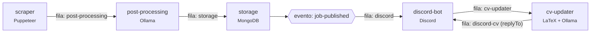

# Jobs Scraper 🚀💼

Pipeline que coleta postagens de vagas no LinkedIn, estrutura os dados com IA local (Ollama), salva no MongoDB e publica as vagas em um canal do Discord. Os serviços se comunicam por filas do RabbitMQ.

## 🗺️ Visão geral

Os blocos são os serviços; os rótulos nas setas são as filas do RabbitMQ que os ligam. O hexágono é um evento: cada canal liga a própria fila nele e recebe todas as vagas.



Cada fila tem o mesmo nome do serviço que a consome. A fila `scraper` recebe comandos para o scraper, como o "coletar agora" (`bun scraper:run` ou de outras fontes).

O núcleo (scraper → post-processing → storage → cv-updater) não depende do Discord, e o bot é só um dos canais:

- **Vagas:** o storage publica cada vaga nova no evento `job-published` (exchange fanout). O bot liga a fila `discord` nele; outro canal (Telegram, site…) ligaria a própria fila e receberia todas as vagas também. Se nenhum canal estiver ligado, o storage não marca a vaga como publicada e tenta de novo depois.
- **Currículos:** o pedido (`CvRequest`) traz um `replyTo` com a fila de resposta e um contexto livre. O cv-updater devolve o resultado nessa fila, com o mesmo contexto. O bot usa a fila `discord-cv` e guarda no contexto o token da interação do Discord.

1. **Scraper** (`src/services/scraper`): usa Puppeteer para buscar posts no LinkedIn. Cada post recebe um `postId` (hash do texto normalizado) e é enviado para a fila `post-processing`.
2. **Pós-processamento** (`src/services/post-processing`): ignora posts já vistos, usa um modelo do Ollama para extrair os dados da vaga e envia o resultado para a fila `storage`.
3. **Armazenamento** (`src/services/storage`): salva a vaga no MongoDB (sem duplicar, por causa do índice único em `postId`) e publica o evento `job-published`.
4. **Bot do Discord** (`src/services/discord-bot`): publica cada vaga como um card (embed) com cargo, empresa, local, modalidade, data, tecnologias e botões para o post e para o contato do recrutador.
   - Num **canal de texto**, cada vaga vira uma mensagem.
   - Num **canal de fórum**, cada vaga vira um post próprio. O bot aplica as tags do fórum que batem com a modalidade ou as tecnologias (crie tags como "Remoto" ou "Vue" no fórum).
5. **Currículo ajustado** (`src/services/cv-updater`): ao clicar em "📧 Contato do recrutador" (ou "📄 Gerar currículo", quando a vaga não tem e-mail), o bot responde só para você com o contato e, segundos depois, envia um PDF do seu currículo ajustado à vaga.

### 📄 Currículo ajustado (cv-updater)

O currículo base é o seu próprio `.tex` (o mesmo do Overleaf), em `data/cv/cv.tex`. O serviço reescreve só os trechos de texto e compila com o [Tectonic](https://tectonic-typesetting.github.io), então o PDF sai com **o mesmo design** do original:

- **Apresentação**: reescrita pela IA para a vaga, destacando o que combina e citando as tecnologias pedidas (que também entram nas habilidades).
- **Habilidades**: entram as tecnologias pedidas pela vaga (na categoria certa; nuvem e DevOps vão para ferramentas) e ficam só as suas categorias relacionadas à vaga, com as tecnologias da vaga primeiro. Conceitos e metodologias ("Agile", "Component-driven architecture") não entram como tecnologia.
- **Projetos**: com `GITHUB_USERNAME` configurado, os projetos (`CV_MAX_PROJECTS`, padrão 2) são escolhidos entre os seus repositórios públicos por ranqueamento: +10 por tecnologia da vaga que o projeto usa (linguagens, topics e dependências do `package.json`), +3 se tem descrição e +3 se tem topics; desempate pelo mais recente. Projetos que já estão no `.tex` usam o texto que você escreveu; os demais ganham uma descrição gerada a partir do README. Forks, arquivados e os listados em `GITHUB_EXCLUDE_REPOS` ficam de fora. Sem GitHub, ficam os projetos do `.tex`, reordenados.
- **Experiência**: bullets reordenados por relevância; nenhum é criado ou removido.

Se o resultado passar de uma página, primeiro sai um projeto e depois volta a apresentação original, até caber. Os PDFs gerados ficam em `data/cv/generated/`.

**Configuração:**

1. Coloque seu currículo em `data/cv/cv.tex`. Use o `src/services/cv-updater/assets/cv.example.tex` como referência do formato esperado: seções `Apresentação`, `Habilidades Técnicas` (`\item \textbf{Categoria:} item, item`), `Projetos` (blocos separados por `\vspace`) e `Experiência Profissional` (bullets em `itemize`). A pasta `data/` inteira fica fora do git.
2. Instale o [Tectonic](https://github.com/tectonic-typesetting/tectonic/releases) e aponte `TECTONIC_BIN` para o executável (no Docker ele já vem na imagem). Na primeira compilação, ele baixa os pacotes LaTeX e guarda em cache.
3. A fonte Nunito (usada pelo modelo) já vem em `src/services/cv-updater/assets/fonts/` (licença OFL). Se o seu `.tex` usar outra fonte com `\setmainfont{Fonte}`, coloque os arquivos `Fonte-Regular.otf`, `Fonte-Italic.otf` e `Fonte-Bold.otf` (ou `-ExtraBold.otf`) nessa pasta.

### Filas, retries e DLQ

Para cada fila `X` existem também:

- `X.retry`: mensagens que falharam por erro transitório esperam ali (backoff exponencial a partir de `QUEUE_RETRY_DELAY_MS`) e depois voltam para `X`.
- `X.dlq`: mensagens com formato inválido ou que falharam mais de `QUEUE_MAX_RETRIES` vezes. Inspecione pelo painel do RabbitMQ.

As mensagens são persistentes e validadas com os schemas de `src/shared/contracts/`.

## 🛠️ Tecnologias

- **Bun** + **TypeScript**
- **Puppeteer** (scraping)
- **RabbitMQ** (mensageria)
- **MongoDB** + Mongoose (armazenamento)
- **Ollama** (IA local)
- **Discord.js** (bot)
- **Tectonic** (LaTeX, para o currículo)
- **Zod** (validação de configuração e mensagens), **Pino** (logs)
- **Docker Compose** (infraestrutura e serviços)

## 🏃‍♂️ Como rodar localmente

Pré-requisitos: [Bun](https://bun.sh) 1.4+ e Docker.

1. **Clone o repositório e instale as dependências:**

   ```bash
   git clone https://github.com/P0sseid0n/jobs-scraper.git
   cd jobs-scraper
   bun install
   ```

2. **Configure o `.env`:**

   ```bash
   cp .env.example .env
   ```

   Preencha as credenciais (LinkedIn, Discord) e troque as senhas da infraestrutura. Todas as variáveis estão documentadas no `.env.example`. Cada serviço valida as suas variáveis na inicialização e encerra com uma mensagem clara se faltar alguma.

3. **Suba a infraestrutura** (RabbitMQ, MongoDB, mongo-express e Ollama):

   ```bash
   docker compose up -d
   ```

   **Com GPU NVIDIA**, descomente `COMPOSE_FILE` no `.env`. Assim qualquer comando `docker compose` inclui o `docker-compose.gpu.yml`. Sem isso, um `docker compose up` sem o `-f docker-compose.gpu.yml` recria o Ollama **sem GPU**, e o modelo passa a rodar na CPU e a consumir muita RAM. Para conferir, rode `docker compose exec ollama ollama ps`: a coluna `PROCESSOR` deve mostrar `100% GPU`.

   O serviço `ollama-init` baixa automaticamente o modelo definido em `OLLAMA_MODEL` (padrão `gemma3:4b`). A primeira vez pode demorar. Acompanhe com `docker compose logs -f ollama-init`.

4. **Inicie os serviços em modo desenvolvimento:**

   ```bash
   bun dev            # todos os serviços
   bun dev:scraped    # tudo menos o scraper (só processa o que já está nas filas)
   ```

### Rodando tudo em containers

```bash
docker compose --profile app up -d --build
```

Por padrão o scraper roda uma coleta e termina. Para coletar periodicamente, defina `SCRAPER_INTERVAL_MINUTES` (ex.: `180` para a cada 3 horas). Outra opção é agendar `docker compose --profile app run --rm scraper` com cron ou com o Agendador de Tarefas.

### Configurações em tempo de execução

Os termos de busca, o filtro de data, o limite de posts, o intervalo, a pausa das coletas, a confiança mínima da IA, os idiomas aceitos e as palavras-chave das vagas ficam na coleção `settings` do MongoDB (um documento por serviço), preparados para serem editados por outras fontes. Os valores do `.env` (`SEARCH_KEYWORDS`, `SCRAPER_DATE_POSTED`, `SCRAPER_MAX_POSTS`, `SCRAPER_INTERVAL_MINUTES`, `MIN_JOB_CONFIDENCE`, `JOB_LANGUAGES`, `JOB_REQUIRED_KEYWORDS`, `JOB_EXCLUDED_KEYWORDS`) só preenchem esse documento na primeira execução; depois disso, valem os do banco. Para voltar a usar o `.env`, apague o documento (ex.: pelo Mongo Express).

- O idioma de cada post é detectado no texto (biblioteca `franc`, sem IA), e os que não estiverem em `allowedLanguages` (padrão: só `pt`) são descartados antes de chamar a IA. Lista vazia aceita todos; posts curtos demais para detectar seguem normalmente.
- A busca do LinkedIn é ampla e traz vagas de outras áreas. Depois da extração, a vaga precisa citar no cargo ou nos conhecimentos ao menos uma palavra de `requiredKeywords` e nenhuma de `excludedKeywords`. A comparação é por palavra inteira ("java" não pega "javascript") e ignora caixa, acentos, hífen e ".js" ("Vue.js" = "vue", "Front End" = "front-end"). Listas vazias desligam o filtro.
- `SEARCH_KEYWORDS` aceita vários termos separados por vírgula; cada um vira uma busca na mesma coleta, e o limite de posts é dividido entre eles.
- Com o scraper rodando continuamente, ele relê as configurações a cada 30 segundos: mudanças valem sem reiniciar.
- `bun scraper:run` pede uma coleta imediata (qualquer outra fonte pode fazer o mesmo publicando na fila `scraper`), mesmo com as coletas pausadas.
- Cada coleta fica registrada em `scraper_runs` (em andamento, sucesso ou falha, com os posts enviados por termo) por 90 dias.

Para outras fontes: as configurações são lidas e salvas com `loadSettings`/`updateSettings` (`@shared/settings`), que validam tudo com os schemas de `@shared/contracts` (`ScraperSettingsSchema`, `PostProcessingSettingsSchema`); o "coletar agora" é uma mensagem `ScraperCommand` publicada na fila `scraper`.

A sessão do LinkedIn fica salva em `data/scraper/linkedin-cookies.json` (no Docker, no volume `scraper_data`), então o login só é refeito quando ela expira. Se o LinkedIn pedir captcha ou 2FA, rode com `HEADLESS=false` e resolva na janela do navegador.

### Painéis

Todas as portas ficam publicadas apenas em `127.0.0.1`.

- RabbitMQ: http://localhost:15672 (`RABBITMQ_USER` / `RABBITMQ_PASSWORD`)
- mongo-express: http://localhost:8081 (`MONGO_EXPRESS_USER` / `MONGO_EXPRESS_PASSWORD`)

## 🧰 Scripts

| Script                                              | Descrição                                                |
| --------------------------------------------------- | -------------------------------------------------------- |
| `bun dev`                                           | Todos os serviços com `--watch`                          |
| `bun dev:scraped`                                   | Todos menos o scraper (só processa o que está nas filas) |
| `bun dev:<scraper\|processing\|storage\|bot\|cv>`   | Um serviço, com `--watch`                                |
| `bun start:<scraper\|processing\|storage\|bot\|cv>` | Um serviço, sem `--watch`                                |
| `bun scraper:run`                                   | Pede uma coleta imediata ao scraper (fila `scraper`)     |
| `bun run typecheck`                                 | Checagem de tipos (`tsc --noEmit`)                       |
| `bun run lint` / `bun run lint:fix`                 | Lint com Biome                                           |
| `bun run format` / `bun run format:check`           | Formatação com Prettier                                  |
| `bun test`                                          | Testes                                                   |

O CI (GitHub Actions) roda `typecheck`, `lint`, `format:check` e `test` em todo push e PR. O estilo de código fica no `.prettierrc` e no `.editorconfig`; no VS Code, use a extensão do Prettier com formatação ao salvar.

## 📁 Estrutura

```
src/
  shared/                      # código usado por mais de um serviço (importado como @shared/<módulo>)
    service/                   #   startService(): logger, .env, MongoDB e RabbitMQ prontos em uma chamada
    settings/                  #   configurações editáveis em tempo de execução (coleção settings)
    config/                    #   carregamento e validação do .env (zod) e variáveis de infraestrutura
    contracts/                 #   formato das mensagens que trafegam nas filas
    database/                  #   conexão com o MongoDB e modelos (Job, SeenPost, Settings, ScraperRun)
    messaging/                 #   cliente RabbitMQ, nomes das filas e política de retry/DLQ
    logging/, lifecycle/       #   logger e encerramento gracioso
  services/
    scraper/                   # coleta posts no LinkedIn
      scrape-run.ts            #   uma coleta: busca cada termo, lê os posts e publica os novos
      scheduler.ts             #   agenda das coletas e "coletar agora" (fila scraper)
      run-history.ts           #   histórico das coletas (coleção scraper_runs)
      browser-session.ts       #   navegador (stealth) e cookies da sessão
      login.ts                 #   login e verificação (captcha/2FA)
      feed-reader.ts           #   leitura dos posts e paginação
      linkedin/                #   URLs, seletores, URN do post, cookies e limpeza de texto
    post-processing/           # extrai a vaga do post com IA
      job-extraction.ts        #   chamada ao modelo e montagem da vaga
      extraction-prompt.ts     #   prompt e schema enviados ao modelo
      model-response.ts        #   leitura e validação da resposta
    storage/                   # salva no MongoDB e publica o evento job-published para os canais
    discord-bot/               # publica as vagas e entrega o currículo
      job-publisher.ts         #   canal das vagas (texto ou fórum) e envio do card
      job-card.ts              #   card (embed) da vaga
      contact-button.ts        #   clique no botão de contato (pede o currículo)
      contact-reply.ts         #   texto da resposta do botão
      cv-delivery.ts           #   envio do PDF gerado
    cv-updater/                # gera o currículo ajustado à vaga
      base-resume.ts           #   leitura do cv.tex base
      tailoring-suggestions.ts #   sugestões da IA (apresentação, habilidades, projetos)
      tailoring-prompt.ts      #   prompt e schema dessas sugestões
      tailor-resume.ts         #   monta o currículo da vaga (habilidades, projetos, experiência)
      resume-pdf.ts            #   PDF em uma página (simplifica se não couber)
      latex-compiler.ts        #   compilação com o Tectonic
      resume/                  #   leitura e escrita do .tex sem alterar o design
      skills/                  #   seção de habilidades e associação entre tecnologias da vaga e do currículo
      projects/                #   GitHub (API e cache), ranking, escolha e descrição dos projetos
      assets/                  #   fontes e cv.example.tex
data/                          # dados de execução, fora do git: cv/cv.tex, cv/generated/, cache/, scraper/
```

Cada serviço tem um `index.ts` (ponto de entrada, que chama `startService()` e registra os consumers) e, quando precisa, um `config.ts` (variáveis de ambiente próprias). Os módulos de `shared/` são importados pelo barrel (`@shared/messaging`, `@shared/contracts`...). Os imports ficam em três grupos (pacotes, `@shared`, locais), ordenados automaticamente pelo Prettier. Os testes ficam ao lado do arquivo testado (`*.test.ts`).

## ⚠️ Observações importantes

- O Mongo e o RabbitMQ só criam o usuário quando o volume é criado. Para trocar as credenciais depois, recrie os volumes com `docker compose down -v`. Isso **apaga os dados**.
- **NUNCA** suba o `.env` ou a pasta `data/` (currículo pessoal e sessão do LinkedIn) para o repositório.
- Fazer scraping do LinkedIn vai contra os Termos de Uso da plataforma e pode levar ao bloqueio da conta. Use uma conta dedicada, mantenha o limite de posts baixo, use o filtro de data e espace as coletas (intervalo de algumas horas), sem muitos termos de busca.
- Os logs em nível `info` registram apenas IDs e metadados. O conteúdo dos posts e as respostas da IA só aparecem com `LOG_LEVEL=debug`.

## 📄 Licença

Este projeto está licenciado sob a licença MIT. Veja o arquivo [LICENSE](LICENSE) para mais detalhes.
